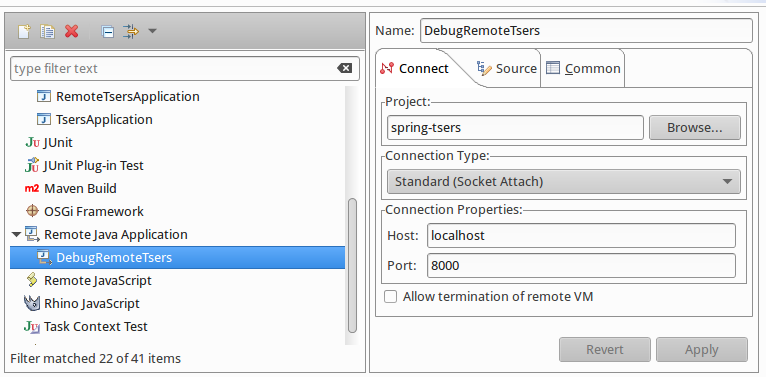

## Welcome Backend Developer to Spring Boot Skeleton project

Hi! this it an example readme you can use it in the new projects, please when you copy the project remove this block.

# This is APP NAME title <-- Change me

##### Required
- GIT
- [Docker](https://docs.docker.com/install/)
- [docker-compose](https://docs.docker.com/compose/install/)
- openjdk >= 11.0.3-jre [help link](https://linuxize.com/post/install-java-on-ubuntu-18-04/)
- [Eclipse IDE](https://linuxize.com/post/install-java-on-ubuntu-18-04/)

### How to Install the project on a local environment

```

$ git clone [repository]   <--- please remember change the repository

$ cd springboot-skeleton

$ cp env-example .env

$ docker-compose up

 ```
 
Go to: [http://localhost:8080](http://localhost:8080)

Enjoy!
 
### Configure Eclipse
First import this code as Gradle Project.

##### Configure the Remote Spring Application, please follow this steps in Epclise:
* Run Configurations -> Java Application -> New
* Choose the project
* Choose **org.springframework.boot.devtools.RemoteSpringApplication** as the main class
* Set **http://localhost:8080** to program arguments


##### Configure the Debug Remote, please follow this steps in Epclise:
* Debug Configurations -> Remote Java Application -> New
* Choose the project
* Set Connection Type: **Standard (Socket Attach)**
* Set Host: **localhost**
* Set Port: **8000** *#Or the port that we configure in the .env DEGUB_PORT*


 
Credits: [@lhartikk](https://medium.com/@lhartikk/development-environment-in-spring-boot-with-docker-734ad6c50b34)

### Customize
##### The name of the Docker image: 

If you need to change the name of your image, you only need to edit your *.env* and configure the APP variable.
 
##### The .jar file name:

If you need to change the jar file name, you only need to edit your *.env* and configure the JAR_NAME variable.
 
##### The ports:

If you need other ports, you only must edit your *.env* and set the application port and the debugger port on your variables.
 
### Others

You can install the Chrome Extension [LiveReload](https://chrome.google.com/webstore/detail/livereload/jnihajbhpnppcggbcgedagnkighmdlei) it is supported